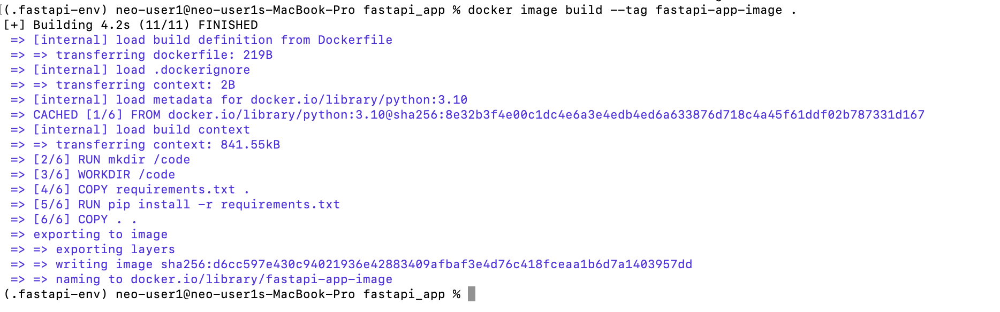
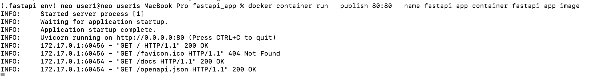

## Setting up our development environment

create a virtual environment
```
python3 -m venv <env-name>
```
activate the virtual environment, run 
```
source <env-name>/bin/activate
```
In the directory where you want to start your project, run 
```
mkdir <my_app>
```
navigate to your app folder
```
cd <my_app>
```
Install FastApi
```
pip install fastapi
```

install uvicorn if it is needed
```
pip install uvicorn
```

To create a requirements file in the <my_app> folder with all the installed dependencies, run
```
pip freeze > requirements.txt 
```

to start your FastAPI application, run
```
uvicorn main:app --reload 
```
You should see something like this:
```
(.fastapi-env) neo-user1@neo-user1s-MacBook-Pro fastapi_app % uvicorn main:app --reload
INFO:     Will watch for changes in these directories: ['/Users/tanja/MyProjects/fastapi-doker-app/fastapi_app']
INFO:     Uvicorn running on http://127.0.0.1:8000 (Press CTRL+C to quit)
INFO:     Started reloader process [84826] using StatReload
INFO:     Started server process [84828]
INFO:     Waiting for application startup.
INFO:     Application startup complete.
INFO:     127.0.0.1:54760 - "GET / HTTP/1.1" 200 OK
INFO:     127.0.0.1:54761 - "GET /docs HTTP/1.1" 200 OK
INFO:     127.0.0.1:54761 - "GET /openapi.json HTTP/1.1" 200 OK
```
Point your browser to [http://127.0.0.1:8000/docs](http://127.0.0.1:8000/docs). You should see the two endpoints we just added documented:


Now, we have a basic FastAPI application but to improve the development experience, we can eliminate the need to create a virtual environment and install the project dependencies manually. This optimization would handle what dependencies to install, where to install them, and how to install them when porting our project to other platforms. Let’s learn how to do this with Docker

## Dockerizing our FastAPI application
By running the project inside a Docker container, we can eliminate the need to create a virtual environment and having to install project dependencies manually.
### Docker container
You can think of a Docker container as a small computer that runs on another computer. Essentially, a Docker container is just an isolated environment on some machine that contains a project’s code and its dependencies.
<p>When we containerize or dockerize our FastAPI application, we are essentially creating a lightweight virtual box with our project’s dependencies installed and our FastAPI code configured to run. As a result, anyone with our virtual box could run our application without having to deal with the low-level project configuration logistics.</p>

### Docker image
In our example, what we share with other people or deploy to our servers is not the container or virtual-box itself, but the manual for creating the container. You probably already know this manual as the Docker image.

A Docker image contains step-by-step instructions for building a container. Containers are spun from images during the build step. But, to create a Docker image, we first need to write a Docker file.

To containerize our FastAPI application, we need to follow three steps:
- Write a Dockerfile
- Build a Docker image from our Dockerfile
- Spin up a container from the Dock
er image we built

### Writing our Dockerfile
Create a <my_app>/Dockerfile file and add the code snippet below:
```
FROM python:3.10
RUN mkdir /code
WORKDIR /code
COPY requirements.txt .
RUN pip install -r requirements.txt
COPY . .
CMD ["uvicorn", "main:app", "--host=0.0.0.0", "--port=80"]

```
We populated our Dockerfile with a set of instructions that the Docker daemon would follow chronologically to build our image when issued the command.

When you install Docker, it automatically installs the Docker client, which accepts Docker commands in your terminal and the Docker daemon. Think of the Docker daemon as Docker’s backend, the main entity that processes commands received by the Docker client.

Let’s make sense of what each command in our Dockerfile above means. The <code>FROM</code> instruction sets the official Python image as the base. It instructs the Docker daemon to build our image on top of an existing image. Docker adopts this layered approach to enhance reusability.
<p>
<code>RUN mkdir /code</code> creates a code directory in the image when it is built and eventually the container when it is created.</p>
The <code>WORKDIR</code> instruction sets the default working directory to the newly created <code>/code</code> directory. This working directory will be applicable to any subsequent <code>COPY</code>, <code>ADD</code>, <code>RUN</code>, and <code>CMD</code> instructions.

The first <code>COPY</code> instruction adds the requirements.txt file to the current working directory. The <code>RUN</code> instruction executes the <code>pip install -r requirements.txt</code> command. This command would install the dependencies listed in the requirements file in our container.

The second <code>COPY</code> instruction copies the rest of the content from the current directory <code>.</code> of the host filesystem to the working directory <code>.</code> inside the image and eventually the container. Lastly, the <code>CMD</code> instruction sets the command for running our application’s server published on <code>port 8080</code>.

### Building the Docker image from our Dockerfile

Go to your <my_app> directory in your terminal and then run the following command:
```
docker image build --tag <my-app-image> .
```
To build our image, the Docker daemon needs a few pieces of information. For one, it needs the name of the <code>Dockerfile</code> to use. If this isn’t passed, Docker looks for a file named <code>Dockerfile</code> in the working directory. If you name your file anything other than <code>Dockerfile</code>, then you must pass the name of the file using the <code>--file</code> option:
```
docker image build --file custom-docker-file-name --tag <my-app-image>
```
Docker also needs the build context. The build context is the directory that’s accessible to Docker during the build process. In our case, we specified the current working directory as the build context with ..

If the image build was successful, you should get an output similar to the image below:


At this point, you should have an image called <code><my-app-image></code> on your machine. You can run the <code>docker image ls</code> command to see a list of all the images you’ve created or pulled to your local machine from the registry.

### Running the container from our Docker image

Run the command below to spin up a container from our <my-app-image>:
```
docker container run --publish 80:80 --name fastapi-app-container <my-app-image>
```
The <code>--name</code> option creates a container with the name <code>demo-app-container</code> that is based on the <code><my-app-image></code>. The <code>--publish</code> option forwards requests coming through <code>port 8080</code> on our local machine to <code>port 8080</code> in our container.

If the command works, you should get the following output in your terminal:

You can point your browser to [http://localhost:80/docs](http://localhost/docs) to visit the documentation page. 
