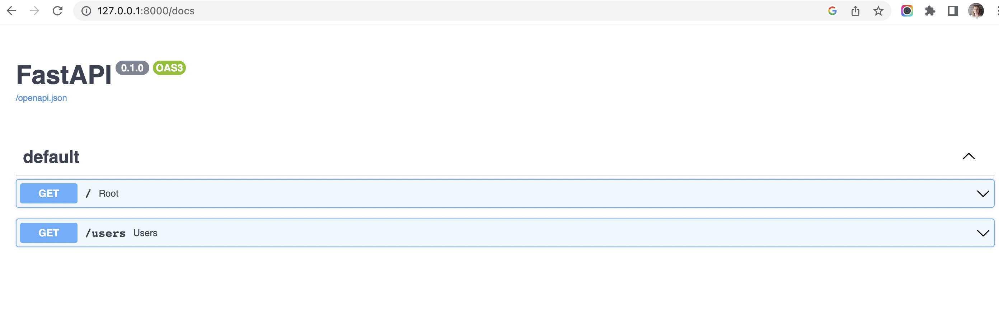

## Setting up our development environment

create a virtual environment
```
python3 -m venv <env-name>
```
activate the virtual environment, run 
```
source <env-name>/bin/activate
```
In the directory where you want to start your project, run 
```
mkdir <my_app>
```
navigate to your app folder
```
cd <my_app>
```
Install FastApi
```
pip install fastapi
```

install uvicorn if it is needed
```
pip install uvicorn
```

To create a requirements file in the <my_app> folder with all the installed dependencies, run
```
pip freeze > requirements.txt 
```

to start your FastAPI application, run
```
uvicorn main:app --reload 
```
You should see something like this:
```
(.fastapi-env) neo-user1@neo-user1s-MacBook-Pro fastapi_app % uvicorn main:app --reload
INFO:     Will watch for changes in these directories: ['/Users/tanja/MyProjects/fastapi-doker-app/fastapi_app']
INFO:     Uvicorn running on http://127.0.0.1:8000 (Press CTRL+C to quit)
INFO:     Started reloader process [84826] using StatReload
INFO:     Started server process [84828]
INFO:     Waiting for application startup.
INFO:     Application startup complete.
INFO:     127.0.0.1:54760 - "GET / HTTP/1.1" 200 OK
INFO:     127.0.0.1:54761 - "GET /docs HTTP/1.1" 200 OK
INFO:     127.0.0.1:54761 - "GET /openapi.json HTTP/1.1" 200 OK
```
Point your browser to [http://127.0.0.1:8000/docs](http://127.0.0.1:8000/docs). You should see the two endpoints we just added documented:



Now, we have a basic FastAPI application.

